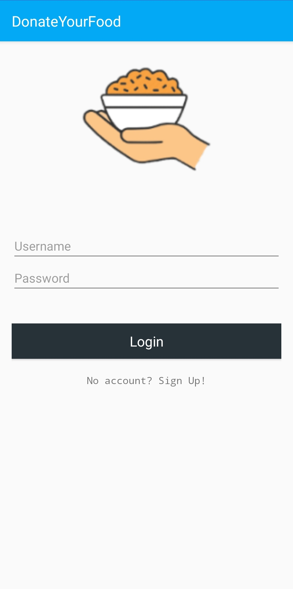
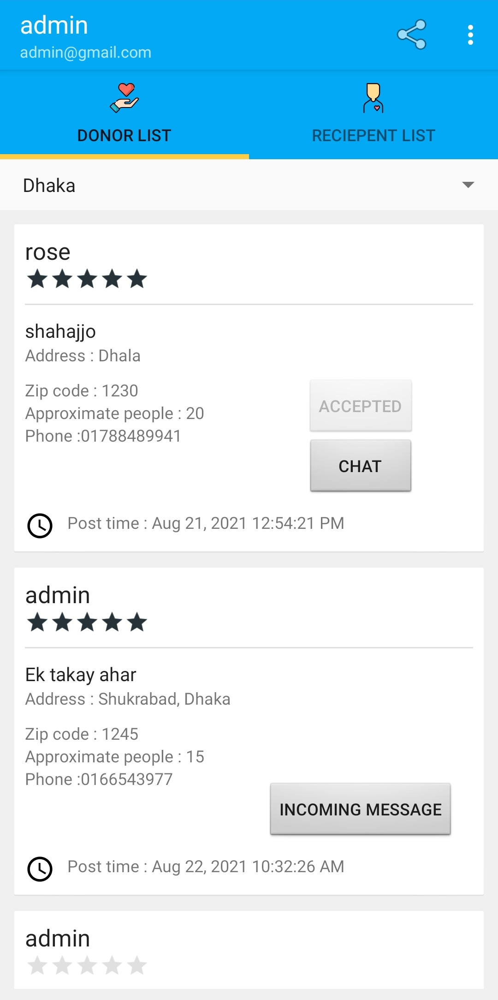
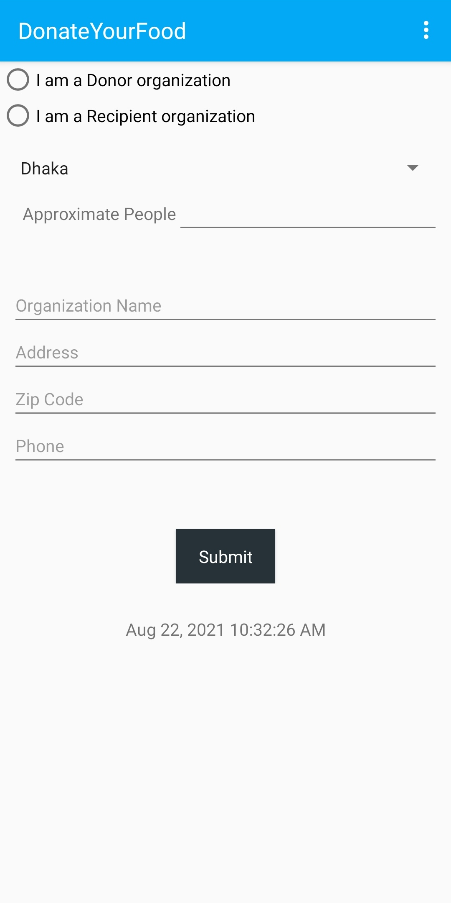
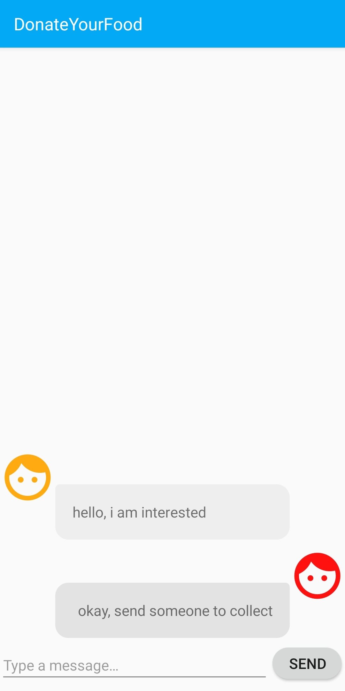
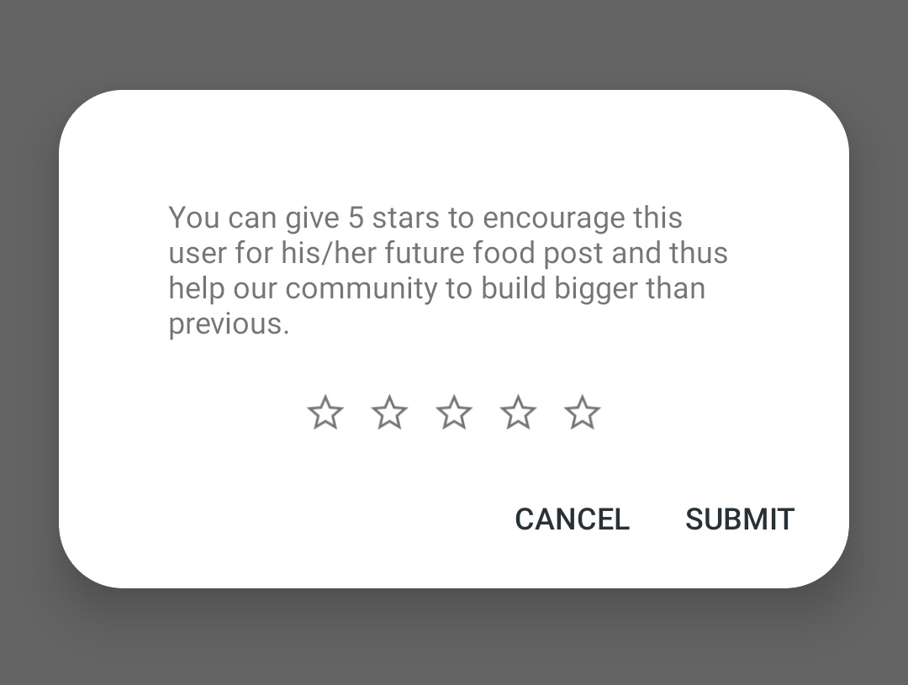

 # Community driven food donation platform
 My little contribution to help food wastage by creating a simple android app to create a community of giving and helping in order to reduce food wastage.
 
 
 # Installation
 since i have used back4app instead of firebase, the initialization part is as follows:
   - create an account in back4app.com
   - create a new project
   - go to app settings from the project dashboard and click on security and keys
   - copy the application id and client key and paste them in the strings.xml file in the project
   - sync the app and then build, voila!
  
   I am still working on push notifications, so the firebase dependencies are currently not in use
 
# **Login / Signup Screen**

# **Dashboard**

# **Form Screen**

# **In app messaging**

# **Rating**

