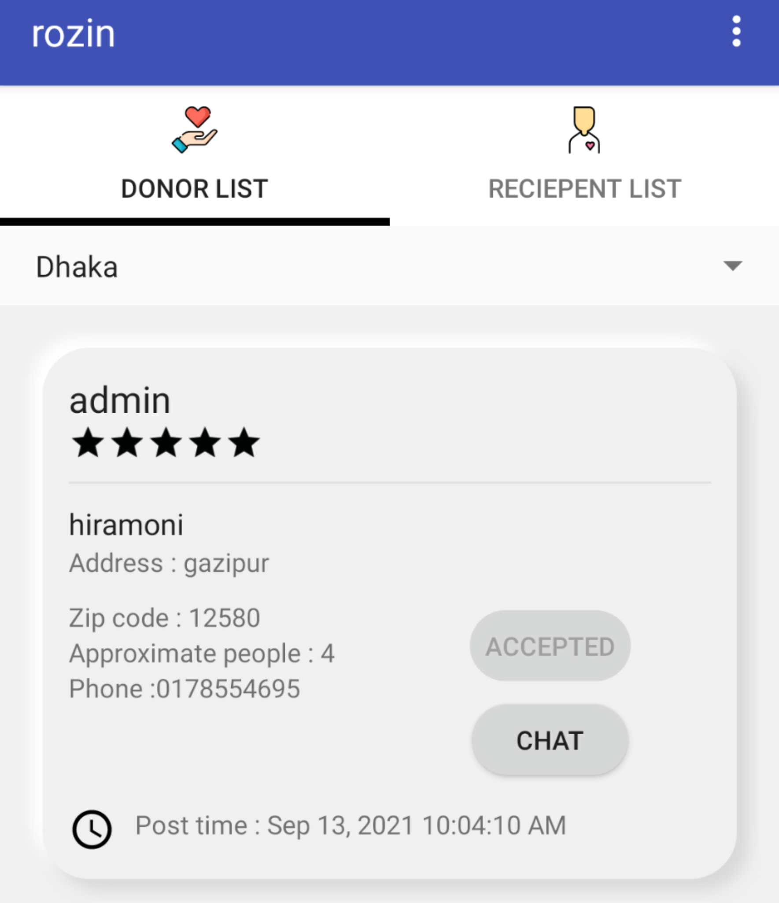

 # Community driven food donation platform
 My little effort to help reduce food wastage by creating a simple android app to create a community of giving and helping in order to reduce food wastage.
 
 
 # Installation
 since i have used back4app instead of firebase, the initialization part is as follows:
   - create an account in back4app.com
   - create a new project
   - go to app settings from the project dashboard and click on security and keys
   - copy the application id and client key and paste them in the strings.xml file in the project
   - sync the app and then build, voila!
  
   I am still working on push notifications, so the firebase dependencies are currently not in use
 
# **Login / Signup Screen**

People can sign up using their email to either donate their excess food or receive the excess food donated by others.

# **Form Screen**

You can create a food as either a food donator or a food receiver

# **Dashboard**

Tabview showing all the posts in different regions about either people wanting to receive food or wanting to donate food, users can either accept or ignore the posts

# **In app messaging**

After a post has been accepted by a user, that user and the poster can communicate directly in the app by using the in app messaging

# **Rating**

There is also an option to rate users based on their behaviour, ease of access to the food, quality of the food etc.

